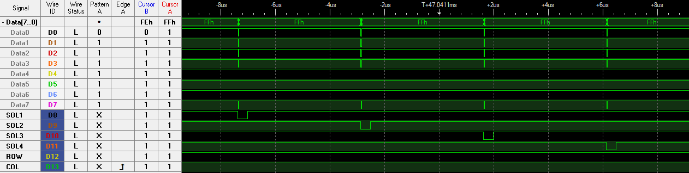
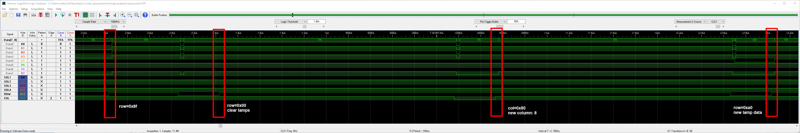

# Bus protocol

## General

The bus consists of 8 data lines and some signal "address" lines. In general, there is only one address line active at a given time.
Signals are L-active, the default state of the address and data lines is H. New data will be fetched by the power driver board on the raising edge of an address.

There is often some "noise" on the data bus. This usually happens when an address signal goes to L. As the signal is fetched at the raising edge, this is not a problem.

## Solenoids

Solenoids (and flash lamps) are organised in 4 groups of 8 devices. There are 4 separate solenoid addresses SOL1-SOL4. If no solenoid is active, they will be set to zero regularly. 

## Lamp matrix

Lamp matrix is organized in 8 columns of 8 rows each. The rows are multiplex, which means
each column is only active 1/8s of the time.

First the column is set (only one bit on the data bus is set), next the row data will be set. As the end of a cycle all lamps will be reset to 0. There is another transfer on the bus at the end of each cycle. It's cause is unknown. However as this happens at the end of the cycle, we can simply ignore it. 

